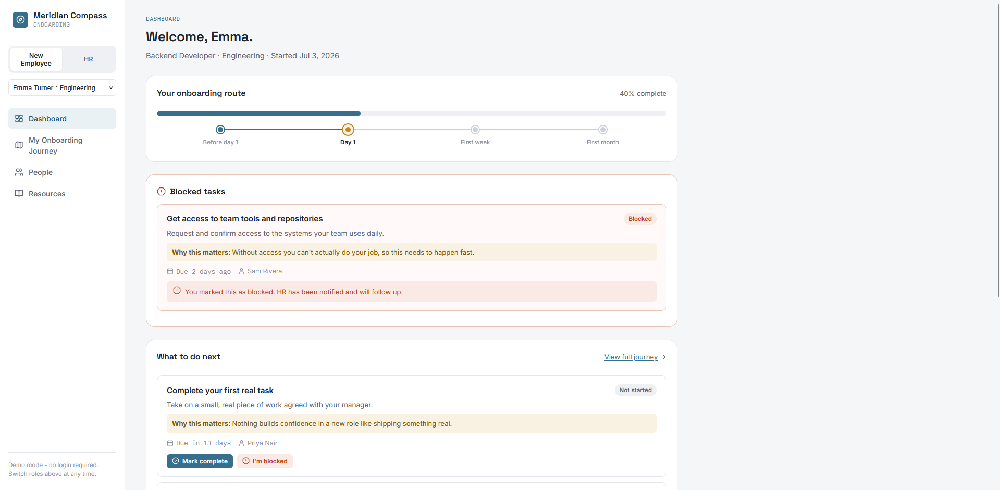
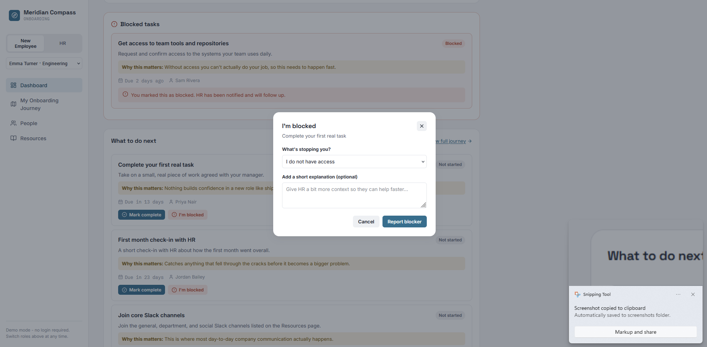
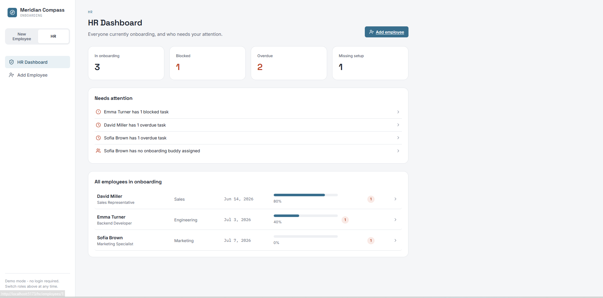
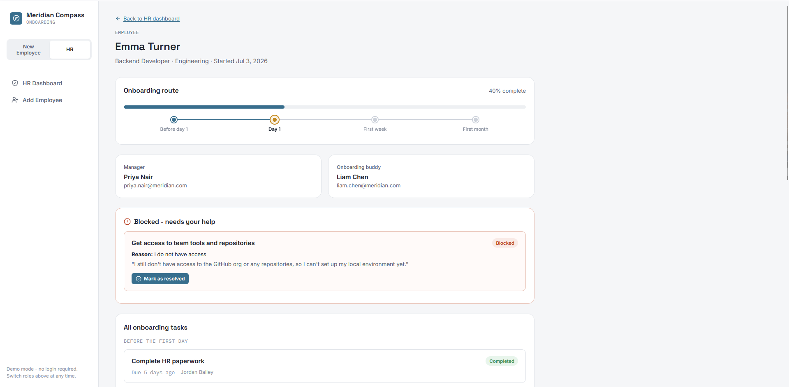

# Meridian Compass

An onboarding companion for new hires at Meridian, a fictional 200-person hybrid
company. Built as a take-home assignment for a Qubiz internship.

## The problem

A new employee at Meridian gets one email before their first day: *"Welcome! See
you on Monday."* Meridian hires 2-3 people a month, but HR is a single person -
there's no time to hand-hold every new hire through their first month.

New employees are left wondering:

1. What should I do today?
2. Why does it matter?
3. Who can help me?
4. What can I do if I'm blocked?

Meridian Compass answers all four, and gives HR a single place to see who
actually needs their attention - instead of finding out three weeks late that
someone's been stuck.

## The core feature: "I'm blocked"

Any onboarding task can be marked as blocked, with a reason (no access, don't
know who to contact, need more information, technical issue, other) and an
optional note. HR sees every open blocker in a **Needs attention** panel and
can resolve it once the person is unblocked. With one HR person for the whole
company, this is the single most useful thing the app does.

## Main features

**For a new employee**
- Dashboard: today's priorities, blocked/overdue tasks, manager and buddy, at a glance
- My Onboarding Journey: every task, grouped into Before day 1 / Day 1 / First
  week / First month, each with a due date, a contact person, and *why it matters*
- People: a directory of the humans worth knowing, with your manager and buddy
  pulled out first
- Resources: company handbook, remote work policy, equipment setup, and more,
  grouped by category
- Mark any task complete, or report it as blocked, in one click

**For HR**
- Dashboard: everyone currently onboarding, with progress, blocked count, and
  overdue count per person
- Needs attention: a single prioritized feed of everyone who needs a human to
  step in - blocked, overdue, missing a manager, or missing a buddy
- Employee details: full task list, open blockers with their exact reason, and
  a one-click resolve
- Add employee: a short form that generates a full onboarding plan
  automatically, from a single source of truth (no copy-pasting task lists)

**Demo mode instead of real login**

There's no authentication - see [DECISIONS.md](DECISIONS.md) for why. A role
switcher in the sidebar lets you view the app as a New Employee (with a dropdown
to pick which of the demo employees you're viewing as) or as HR.

## Tech stack

**Backend:** Python, Flask, Flask-SQLAlchemy, Flask-CORS, SQLite, pytest
**Frontend:** React, TypeScript, Vite, React Router, plain CSS (no UI kit),
lucide-react for icons

No external services, no real auth, no deployment - this runs entirely on
your machine. See [DECISIONS.md](DECISIONS.md) for why.

## Project structure

```
meridian-compass/
  backend/
    app/
      models/       SQLAlchemy models (Employee, Person, OnboardingTask, ...)
      routes/        Flask blueprints - one file per resource
      services/      Business logic (progress calculation, blocker workflow, ...)
      seed/          Demo data generation
    tests/           pytest suite
    config.py
    run.py
    requirements.txt

  frontend/
    src/
      api/            Thin fetch wrappers, one file per backend resource
      components/     Reusable UI pieces (task card, blocker modal, layout, ...)
      pages/          One file per route
      types/          TypeScript types mirroring the backend's JSON shape
      utils/          Date formatting, stage grouping
    package.json

  screenshots/
  README.md
  ASSUMPTIONS.md
  DECISIONS.md
  WHAT_I_WOULD_DO_NEXT.md
  REFLECTION.md
```

## Running it locally

You'll need **Python 3.10+** and **Node.js 18+** installed.

### Backend

```bash
cd backend
python -m venv venv
source venv/bin/activate        # Windows: venv\Scripts\activate
pip install -r requirements.txt

python -m app.seed.seed_data    # creates and populates the database
python run.py                   # runs on http://localhost:5000
```

### Frontend

In a separate terminal:

```bash
cd frontend
npm install
npm run dev                     # runs on http://localhost:5173
```

Open `http://localhost:5173`. The frontend talks to the backend through a Vite
dev proxy, so both need to be running.

### Running the tests

```bash
cd backend
pytest -v
```

30 tests covering onboarding plan generation, progress calculation, the
blocker workflow end to end, and the API routes (including error cases like
missing employees and invalid input).

### Resetting the demo data

If you've clicked around and completed/blocked some tasks, reset to a clean
state at any time:

```bash
cd backend
rm instance/meridian.db         # Windows: del instance\meridian.db
python -m app.seed.seed_data
```

## Demo users / demo flows

The seed data creates three employees in different situations, on purpose:

| Employee | Department | Situation |
|---|---|---|
| **Emma Turner** | Engineering | 2 days into onboarding, 40% done, has one task blocked on missing repository access |
| **David Miller** | Sales | 20 days in, 80% done, one task fell overdue |
| **Sofia Brown** | Marketing | Starts in 3 days, has no onboarding buddy assigned yet |

**Suggested flow as New Employee:**
1. Switch to "New Employee", pick Emma Turner from the dropdown
2. On the Dashboard, see her blocked task and try completing a different one
3. Go to My Onboarding Journey, mark a task as blocked with a reason and a note
4. Check the People and Resources pages

**Suggested flow as HR:**
1. Switch to "HR"
2. On the HR Dashboard, look at "Needs attention" - Emma (blocked), David
   (overdue), Sofia (missing buddy) should all show up
3. Click into Emma Turner's details, read the blocker's exact reason, resolve it
4. Click "Add employee" and create a new hire - watch the onboarding plan
   generate automatically

## Limitations

- No real authentication - anyone can switch roles freely (see ASSUMPTIONS.md)
- No email or Slack notifications - blockers only surface inside the app
- Single onboarding plan template for all departments (see WHAT_I_WOULD_DO_NEXT.md)
- No pagination - fine for a handful of demo employees, would need it at real scale
- SQLite only - not built for concurrent multi-user production use

## Screenshots

**New Employee dashboard** - today's priorities, blocked tasks, and the
waypoint progress tracker



**Reporting a blocker** - the "I'm blocked" modal, with a reason and an
optional note



**HR dashboard** - everyone currently onboarding, and the "Needs attention" feed



**Employee details for HR** - the exact blocker reason, with a one-click resolve


